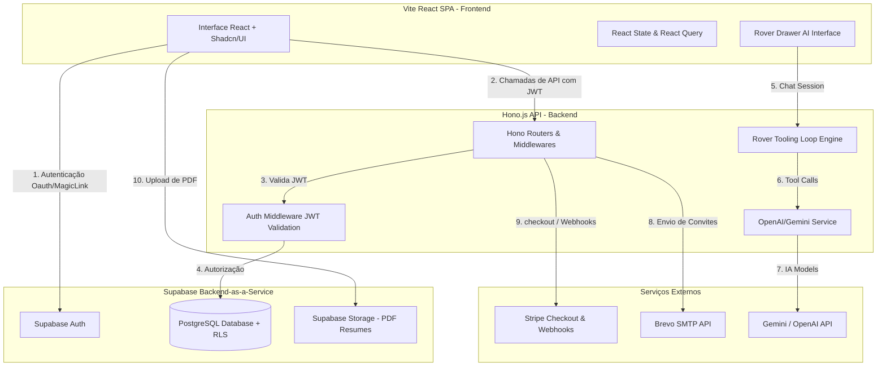

# Estagionauta.com.br 🚀

> **Sua missão rumo ao estágio ideal.** 

O **Estagionauta** é uma plataforma SaaS moderna e otimizada, desenvolvida para acelerar a inserção de estudantes universitários e de ensino técnico no mercado de trabalho. O projeto resolve as principais fricções da jornada do estudante: elaboração e validação de currículos, preparação realista para entrevistas de emprego e conformidade legal sobre contratos de estágio.

---

## 🗺️ Visão Geral do Sistema & Fluxo de Dados

A arquitetura do Estagionauta foi desenhada sobre princípios de **segurança rígida**, **desempenho** e **desacoplamento**. O sistema é estruturado como um monorepo dividido em uma Single Page Application (SPA) no frontend e uma API REST leve no backend.



### 1. Fluxo de Análise de Currículo com IA
1. O usuário faz o upload de um currículo em formato PDF no frontend.
2. O arquivo é enviado e armazenado diretamente no **Supabase Storage** sob políticas restritas de segurança.
3. O frontend envia uma requisição para a API Hono `/api/resume/analyze` contendo a URL do documento.
4. O backend consome 1 crédito do usuário usando a RPC segura `consume_credits`.
5. A API chama o serviço de inteligência artificial injetando diretrizes específicas e personalizadas para estudantes (que valorizam vivências informais, projetos acadêmicos e voluntariados).
6. O resultado estruturado em JSON contendo pontos fortes, pontos fracos e sugestões de melhorias é gravado no banco de dados e retornado ao usuário.

### 2. Fluxo do Rover (AI Agent & Tooling Loop)
1. O painel do **Rover** (o assistente de IA) fica disponível em um drawer na lateral direita.
2. O usuário envia mensagens de texto ou comandos de voz.
3. O backend intercepta as mensagens em `/api/rover/chat`, inicializando um loop interativo de agentes baseado em chamadas de ferramentas (*tool calling*).
4. O Rover pode executar dinamicamente as seguintes ferramentas no servidor dependendo da necessidade do usuário:
   - `check_profile`: Retorna os dados cadastrais do estudante.
   - `check_credits`: Consulta o saldo atual de créditos de simulação/análise.
   - `redeem_coupon`: Resgata créditos através de cupons promocionais (como `ESTAGIO100`).
   - `invite_friend`: Dispara convites por e-mail de indicação.
   - `calculate_recess`: Calcula o recesso proporcional da Lei do Estágio.
   - `get_agencies` / `submit_agency_review`: Busca agências integradoras e submete avaliações.

---

## 🛠️ Stack Tecnológica & Justificativa

### Frontend
- **React 18 & Vite**: Inicialização instantânea em desenvolvimento, builds de produção extremamente otimizados (otimização de chunks) e ecossistema robusto.
- **Tailwind CSS**: Estilização baseada em utilitários, garantindo responsividade total de forma veloz e padronizada.
- **Shadcn/UI & Radix UI**: Componentes de alta qualidade, acessíveis (WAI-ARIA) e personalizáveis por CSS nativo.
- **Framer Motion**: Micro-animações e transições de página fluidas que conferem um acabamento premium à plataforma.
- **React Query (TanStack)**: Gerenciamento eficiente do estado do servidor, cache automático de requisições, sincronização em segundo plano e manipulação limpa de mutations de formulários.

### Backend
- **Hono.js (TypeScript)**: Um framework HTTP ultra-rápido, leve e modular. Perfeito para rodar em ambientes edge ou containers leves (como Cloud Run ou Railway).
- **Zod**: Validação de esquemas e dados de entrada com tipagem estática integrada, garantindo que o backend nunca processe payloads corrompidos.
- **Vitest**: Framework de testes nativo de alta performance com suporte a ES Modules e TypeScript nativos, tornando as validações de rotas rápidas e isoladas.

### Banco de Dados & Infraestrutura
- **Supabase (PostgreSQL)**: Banco de dados relacional de nível empresarial que elimina a sobrecarga de gerenciamento de banco de dados. Fornece recursos nativos como **Row Level Security (RLS)** e hooks para manipulação de claims customizadas no JWT (RBAC).
- **Stripe**: Infraestrutura robusta para cobranças de planos recorrentes e compra de créditos avulsos via PIX ou cartão de crédito.
- **Brevo**: Disparo de e-mails transacionais confiáveis para convites e logs de sistema.

---

## 📂 Estrutura do Monorepo

```
estagionauta/
├── src/                  # Código-fonte do Frontend (Vite + React)
│   ├── components/       # Componentes reutilizáveis (Layout, UI, Rover, Kanban)
│   ├── hooks/            # Hooks customizados (useAuth, useCredits, use-mobile)
│   ├── pages/            # Páginas principais (Index, Dashboard, Perfil, Agencias, etc)
│   ├── route.ts          # Definição e mapeamento de rotas do React Router
│   └── index.css         # Variáveis e CSS global integrado com Tailwind
├── api/                  # Código-fonte do Backend (Hono.js API)
│   ├── src/
│   │   ├── config/       # Configuração de variáveis de ambiente e constantes
│   │   ├── middleware/   # Middlewares (Autenticação JWT, Logger, CORS)
│   │   ├── routes/       # Rotas REST organizadas por recursos (Rover, Referral, Payments)
│   │   ├── services/     # Serviços externos (OpenAI, Stripe, Supabase)
│   │   ├── tools/        # Ferramentas funcionais registradas no Rover Agent
│   │   ├── tests/        # Conjunto de testes de integração e unitários com Vitest
│   │   └── index.ts      # Ponto de entrada do servidor Node
│   ├── package.json      # Dependências e scripts do backend
│   └── tsconfig.json     # Configurações TypeScript da API
├── shared/               # Tipos TypeScript compartilhados (Frontend <-> Backend)
├── supabase/             # Banco de dados
│   ├── migrations/       # Migrações SQL locais (estruturas, triggers, RLS e tabelas)
│   └── config.toml       # Configuração local da CLI do Supabase
└── docs/                 # Documentação técnica e guias de configuração de serviços
```

---

## 🌟 Funcionalidades Principais (Features)

### 1. Análise de Currículo Inteligente (Foco Estudantil)
Focada em apoiar estudantes em início de carreira que possuem pouco ou nenhum histórico profissional formal. O prompt de IA foi especialmente otimizado para extrair valor e orientar a inclusão de:
- Projetos práticos de faculdade e portfólios pessoais.
- Atividades voluntárias e liderança comunitária (ONGs, igrejas, coletivos).
- Experiências informais de apoio (ex: suporte ao comércio familiar).
- Cursos técnicos e complementares relevantes para a área desejada.

### 2. Simulador de Entrevistas Imersivo com Voz
- Permite que o estudante selecione a vaga e simule perguntas técnicas e comportamentais em tempo real.
- **Pipeline de Voz (TTS)**: Membros premium utilizam a API de alta fidelidade OpenAI TTS, enquanto usuários gratuitos usam a API nativa de síntese de voz do navegador (`SpeechSynthesis`), mantendo o recurso acessível a todos sem estourar custos operacionais.

### 3. Diretório de Agências Integradoras
- Um catálogo público e indexado de agências de estágio (CIEE, NUBE, etc.).
- Permite busca textual, filtragem geográfica por estados e leitura de avaliações deixadas por estudantes.
- Moderação de avaliações pelo painel administrativo para combater SPAM ou avaliações abusivas.

### 4. Calculadora de Recesso
- Aplicação das regras da **Lei do Estágio (Lei nº 11.788/2008)**.
- Calcula exatamente o número de dias de recesso remunerado a que o estudante tem direito com base no período trabalhado e datas de início/fim do contrato.

### 5. Rover Drawer AI & Cupons
- Assistente interativo integrado.
- Sistema de cupons integrado: os cupons (ex: `ESTAGIO100` creditando 10 créditos, `BOASVINDAS` creditando 5 créditos) podem ser validados e ativados diretamente por mensagem no Rover ou no painel de créditos.
- Validação automática de convites de indicação contra autoconvites e e-mails já registrados no banco de dados.

---

## 🔒 Políticas de Segurança Rígidas

1. **Secrets estritamente no servidor**: Nenhuma variável sensível (como `STRIPE_SECRET_KEY`, `OPENAI_API_KEY`, `SUPABASE_SERVICE_ROLE_KEY` ou `BREVO_API_KEY`) possui o prefixo `VITE_` e nenhuma delas é compilada no frontend.
2. **Row Level Security (RLS) Mandatório**: Todas as tabelas no Supabase possuem políticas de segurança habilitadas. Nenhuma leitura ou escrita ocorre fora de escopo do usuário autenticado correspondente.
3. **RPCs Protegidas**: Funções de banco de dados críticas como `add_credits` e `consume_credits` possuem políticas estritas, revogando privilégios de execução direta para o papel `anon` ou `authenticated`. Só podem ser chamadas via back-end usando o cliente Supabase administrativo com a `service_role`.
4. **CORS Restrito**: Em produção, apenas requisições partindo de `https://estagionauta.com.br` e `http://localhost:8080` (porta padrão de testes do frontend) são aceitas pela API.

---

## 🚀 Configuração e Instalação Local

### 1. Clonar e Instalar Dependências
No diretório raiz do projeto:
```bash
# Instalar dependências do frontend (raiz)
npm install

# Instalar dependências da API backend
cd api
npm install
cd ..
```

### 2. Configurar Variáveis de Ambiente

Crie o arquivo `.env` na **raiz** do projeto (baseado em `.env.example`):
```env
VITE_SUPABASE_URL=https://seu-projeto.supabase.co
VITE_SUPABASE_ANON_KEY=sua-chave-anon-publica
VITE_STRIPE_PUBLISHABLE_KEY=sua-chave-publica-stripe
VITE_GOOGLE_MAPS_API_KEY=sua-chave-google-maps
VITE_API_URL=http://localhost:3001
```

Crie o arquivo `.env` na pasta **`/api`** (baseado em `api/.env.example`):
```env
PORT=3001
NODE_ENV=development
SUPABASE_URL=https://seu-projeto.supabase.co
SUPABASE_SERVICE_ROLE_KEY=sua-chave-service-role-admin
GEMINI_API_KEY=sua-chave-gemini-do-google-ai-studio-free-tier
GROQ_API_KEY=sua-chave-groq-opcional
STRIPE_SECRET_KEY=sua-chave-privada-stripe
STRIPE_WEBHOOK_SECRET=segredo-webhook-stripe
BREVO_API_KEY=sua-chave-brevo-smtp
BREVO_SENDER_EMAIL=contato@estagionauta.com.br
CLIENT_URL=http://localhost:8080
```

### 3. Subir o Banco de Dados Local (Supabase CLI)
Caso queira rodar o Supabase localmente para desenvolvimento:
```bash
# Iniciar o Supabase Local
supabase start

# Empurrar as migrações mais recentes ao banco
supabase db push
```

### 4. Executando os Servidores de Desenvolvimento
Para rodar ambos simultaneamente em terminais separados:

**Terminal 1 (Frontend):**
```bash
npm run dev
```

**Terminal 2 (API Backend):**
```bash
cd api
npm run dev
```

---

## 🧪 Suíte de Testes e Validação

O backend possui uma cobertura robusta de testes unitários e de integração utilizando o **Vitest**. Os testes simulam chamadas de API, comportamento do banco e resgate de cupons.

Para rodar os testes do backend:
```bash
cd api
npm run test
```

Para rodar testes de ponta a ponta (E2E) com Playwright:
```bash
# No diretório raiz
npx playwright test
```

---

## 🤝 Modelo de Contribuição e Pull Requests

1. Crie uma branch a partir da `main` (`git checkout -b feature/minha-melhoria`).
2. Siga as convenções de código estabelecidas em `AGENTS.md` (código em inglês, termos visuais ao usuário em português, nomes de arquivos em kebab-case).
3. Escreva testes para novas rotas ou ferramentas do Rover.
4. Execute `npm run build` na raiz e na pasta `/api` para confirmar que não existem erros de compilação.
5. Abra o Pull Request detalhando as alterações.

---

**Desenvolvido com ❤️ para impulsionar a carreira dos futuros profissionais brasileiros.**
