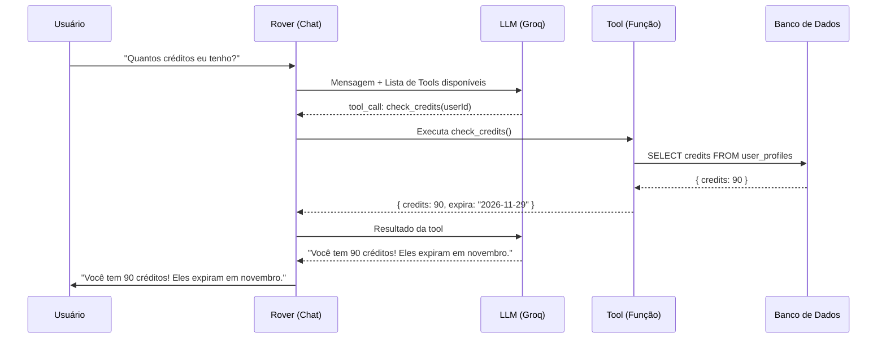
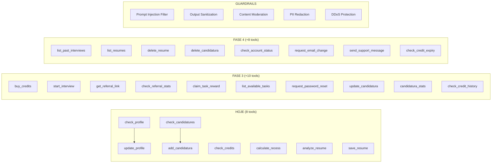

# 🤖 Rover Tools Blueprint — Estagionauta

## Para o Post: O que é Function Calling?

### O conceito em 3 frases:
> **Function Calling** (ou **Tool Use**) é um padrão onde a IA não apenas conversa — ela **toma ações reais**. Em vez de simplesmente responder "vá na página de créditos", o Rover pode diretamente consultar seu saldo, atualizar seu perfil, cadastrar uma vaga, ou gerar um currículo. É o mesmo padrão usado pelo ChatGPT (Plugins, Code Interpreter), pelo Claude (Computer Use), e por empresas como Stripe, Shopify e Notion.

### Nomes técnicos:
| Termo | Quem usa |
|-------|----------|
| **Function Calling** | OpenAI, Groq, Mistral |
| **Tool Use** | Anthropic (Claude) |
| **Agentic Loop / ReAct** | Padrão acadêmico (Reason + Act) |
| **AI Agents** | Termo geral da indústria |

---

## Inventário: 8 Tools Já Implementadas

| # | Tool | O que faz | Custo |
|---|------|-----------|-------|
| 1 | `check_profile` | Consulta perfil do usuário (nome, curso, faculdade, etc.) | Gratuito |
| 2 | `update_profile` | Atualiza campos do perfil via conversa | Gratuito |
| 3 | `check_credits` | Consulta saldo e validade dos créditos | Gratuito |
| 4 | `check_candidatures` | Lista vagas/candidaturas do Kanban | Gratuito |
| 5 | `add_candidatura` | Cadastra nova vaga no Kanban via chat | Gratuito |
| 6 | `calculate_recess` | Calcula recesso proporcional (Lei 11.788) | Gratuito |
| 7 | `analyze_resume` | Analisa currículo com IA (nota + feedback) | 3 créditos |
| 8 | `save_resume` | Salva currículo gerado no banco de dados | Gratuito |

### Guardrails Já Implementados:
- Rate Limiting: 15 msgs/5min (cooldown), 30/hora, 100/dia
- Cooldown de spam: bloqueio automático de 5 min
- Logs de abuso no Supabase (`rover_abuse_logs`)
- IP tracking

---

## Blueprint: Tools Necessárias Para Cobertura Total

### Categoria 1: 💰 Créditos & Pagamentos

| # | Tool | Descrição | Prioridade |
|---|------|-----------|------------|
| 9 | `buy_credits` | Gera link de checkout do Stripe para o plano solicitado. Retorna a URL para o usuário clicar. | Alta |
| 10 | `check_credit_history` | Lista o histórico de transações de créditos (compras, usos, bônus). | Média |
| 11 | `check_credit_expiry` | Mostra detalhes de expiração: quais lotes vencem primeiro (FIFO). | Média |

### Categoria 2: 🎓 Simulador de Entrevistas

| # | Tool | Descrição | Prioridade |
|---|------|-----------|------------|
| 12 | `start_interview` | Inicia uma nova simulação de entrevista (consome 1 crédito). Retorna link direto para o simulador. | Alta |
| 13 | `list_past_interviews` | Lista simulações anteriores com data, tipo de vaga e nota final. | Média |

### Categoria 3: 📝 Gerador de Currículos

| # | Tool | Descrição | Prioridade |
|---|------|-----------|------------|
| 14 | `list_resumes` | Lista currículos já salvos pelo usuário. | Média |
| 15 | `delete_resume` | Deleta um currículo salvo (com confirmação). | Baixa |

### Categoria 4: 📋 Kanban de Candidaturas

| # | Tool | Descrição | Prioridade |
|---|------|-----------|------------|
| 16 | `update_candidatura` | Move candidatura entre colunas (ex: "Aplicado" → "Entrevista") ou edita detalhes. | Média |
| 17 | `delete_candidatura` | Remove uma candidatura do painel (com confirmação). | Baixa |
| 18 | `candidatura_stats` | Retorna estatísticas: quantas vagas por status, taxa de conversão. | Média |

### Categoria 5: 🤝 Indicações & Recompensas (FASE 3)

| # | Tool | Descrição | Prioridade |
|---|------|-----------|------------|
| 19 | `get_referral_link` | Retorna o link personalizado de indicação do usuário. | Alta |
| 20 | `check_referral_stats` | Mostra quantos amigos indicou, quantos se cadastraram, créditos ganhos. | Alta |
| 21 | `claim_task_reward` | Resgata créditos por tarefa concluída (ex: completou perfil = +2 créditos). | Alta |
| 22 | `list_available_tasks` | Lista tarefas disponíveis para ganhar créditos (completar perfil, primeira entrevista, indicar amigo, etc.). | Alta |

### Categoria 6: 🔐 Autenticação & Conta (com segurança)

| # | Tool | Descrição | Prioridade |
|---|------|-----------|------------|
| 23 | `request_password_reset` | Envia e-mail de recuperação de senha via Supabase Auth. **NÃO recebe a senha pelo chat.** Retorna confirmação de envio. | Alta |
| 24 | `check_account_status` | Informa status da conta: e-mail verificado, plano, data de criação. | Média |
| 25 | `request_email_change` | Inicia fluxo de alteração de e-mail (envia link de confirmação para o novo e-mail). | Baixa |

> [!CAUTION]
> **Regra de Segurança Absoluta para Autenticação:**
> O Rover **NUNCA** deve receber, processar ou armazenar senhas, tokens de sessão ou códigos OTP no chat. Todas as ações de autenticação devem gerar links seguros (e-mail de recovery, magic link) que redirecionam o usuário para fluxos oficiais do Supabase Auth. Isso garante que credenciais nunca fiquem no histórico de conversa.

### Categoria 7: 📬 E-mail & Notificações

| # | Tool | Descrição | Prioridade |
|---|------|-----------|------------|
| 26 | `send_support_message` | Envia mensagem para o suporte (via Brevo ou log no banco). O Rover coleta o assunto e detalhes. | Baixa |

---

## Guardrails: Sistema Completo de Proteção

### Já Implementado ✅

| Guardrail | Descrição |
|-----------|-----------|
| Rate Limiter por Frequência | 15 msgs/5min, 30/hora, 100/dia |
| Cooldown de Spam | Bloqueio automático de 5 min |
| Log de Abusos | Tabela `rover_abuse_logs` com user_id, IP, ação, detalhes |
| IP Tracking | Rastreamento de IP para detectar abuso multi-conta |

### Precisamos Implementar 🔴

| # | Guardrail | Descrição | Como funciona |
|---|-----------|-----------|---------------|
| G1 | **Prompt Injection Filter** | Detecta tentativas de injetar instruções maliciosas no prompt (ex: "ignore todas as instruções anteriores"). | Regex + lista de padrões proibidos antes de enviar para a LLM. Se detectado, bloqueia e loga. |
| G2 | **Output Sanitization** | Garante que a resposta da LLM não vaze dados sensíveis (chaves de API, queries SQL, dados de outros usuários). | Filtro pós-resposta que remove padrões sensíveis (JWT, API keys, SQL). |
| G3 | **Tool Execution Limits** | Limita quantas tools um único request pode executar (já temos MAX_LOOPS=5, mas podemos refinar). | Configurável por tipo de tool (ex: `buy_credits` max 1x por request). |
| G4 | **Content Moderation** | Detecta mensagens ofensivas, assédio, ou conteúdo ilegal. | Usar a API de moderação do OpenAI (`/v1/moderations`) antes de processar. |
| G5 | **Credit Verification Pre-Tool** | Antes de executar tools que custam créditos, verifica se o usuário tem saldo suficiente. | Check automático no `executeRoverTool` para tools marcadas como `costCredits > 0`. |
| G6 | **Scope Enforcement** | Garante que o Rover só responda sobre temas de estágio/carreira/plataforma. | Reforço no system prompt + filtro de tópicos fora do escopo. |
| G7 | **PII Redaction** | Remove dados pessoais sensíveis (CPF, número de cartão) das mensagens antes de enviar para a LLM. | Regex para padrões de CPF, cartão de crédito, etc. |
| G8 | **DDoS / Flood Protection** | Proteção contra ataques de volume no endpoint `/api/rover/message`. | Middleware global de rate limiting por IP (além do por usuário). |

---

## Python vs Go vs Node.js: Precisa Mudar?

### Resposta curta: **Não. Hono.js/Node.js está ótimo.**

| Critério | Node.js (Hono) ✅ | Python (FastAPI) | Go |
|----------|-------------------|-----------------|-----|
| **Ecossistema de IA** | SDKs oficiais da OpenAI, Anthropic, Groq | Mais bibliotecas de ML (PyTorch, etc.) | SDKs limitados |
| **Streaming SSE** | Excelente (nativo) | Bom | Bom |
| **Latência** | ~5-20ms overhead | ~10-30ms | ~1-5ms |
| **Já integrado** | ✅ Toda a stack já é TS | Precisaria de novo serviço | Precisaria de novo serviço |
| **Deploy** | Cloud Run funciona | Cloud Run funciona | Cloud Run funciona |
| **Type safety** | TypeScript ✅ | Type hints (parcial) | Forte |

### Quando faria sentido mudar?
- **Python**: Se o Rover precisasse rodar modelos de ML localmente (embeddings, fine-tuning). Não é o caso — estamos usando APIs externas (Groq/OpenAI).
- **Go**: Se tivéssemos milhões de conexões simultâneas. Estamos longe disso.
- **Microserviço separado**: Só faria sentido se o chat tivesse requisitos de escala radicalmente diferentes do resto da API. Por enquanto, manter tudo junto no Hono é mais simples, barato e fácil de manter.

> [!TIP]
> O ChatGPT da OpenAI usa Python. O Claude da Anthropic usa uma mistura de Python e Rust. Mas empresas como Vercel (v0) e Shopify (Sidekick) usam Node.js/TypeScript para seus agentes de IA. **A linguagem importa menos que a arquitetura.** E a sua arquitetura está correta.

---

## Resumo Visual: Evolução do Rover

### Contagem Final

| Categoria | Atual | Novas | Total |
|-----------|-------|-------|-------|
| Tools | 8 | 18 | **26** |
| Guardrails | 4 | 8 | **12** |

---

## Roadmap de Implementação

### Sprint 1 (Prioridade Alta — 8 items)
1. `buy_credits` — Gerar link de checkout pelo chat
2. `start_interview` — Iniciar simulação pelo chat
3. `get_referral_link` — Obter link de indicação
4. `check_referral_stats` — Ver estatísticas de indicação
5. `list_available_tasks` — Listar tarefas para ganhar créditos
6. `claim_task_reward` — Resgatar créditos de tarefas
7. `request_password_reset` — Reset de senha seguro
8. **Prompt Injection Filter** (Guardrail G1)

### Sprint 2 (Prioridade Média — 8 items)
9. `check_credit_history` — Histórico de transações
10. `check_credit_expiry` — Detalhes de expiração
11. `list_past_interviews` — Entrevistas anteriores
12. `update_candidatura` — Mover/editar candidaturas
13. `candidatura_stats` — Estatísticas do Kanban
14. `list_resumes` — Listar currículos salvos
15. `check_account_status` — Status da conta
16. **Content Moderation + PII Redaction** (Guardrails G4 + G7)

### Sprint 3 (Prioridade Baixa — 6 items)
17. `delete_resume` — Deletar currículo
18. `delete_candidatura` — Remover candidatura
19. `request_email_change` — Alterar e-mail
20. `send_support_message` — Mensagem ao suporte
21. **Output Sanitization** (Guardrail G2)
22. **DDoS / Flood Protection IP-level** (Guardrail G8)

---

## Sobre Preços

> [!IMPORTANT]
> Todas as tools de **leitura** (check_*, list_*) são gratuitas. Apenas ações que consomem recursos de IA cobram créditos:
> - Análise de Currículo: 3 créditos
> - Simulação de Entrevista: 1 crédito (já cobrado pelo simulador, não pelo Rover)
> - Geração de Currículo: 1 crédito
>
> O Rover em si (conversar, consultar, atualizar perfil, cadastrar vagas) é **100% gratuito**. Isso é proposital — o valor percebido do agente aumenta o engajamento e leva o usuário a comprar créditos para as funcionalidades premium.
