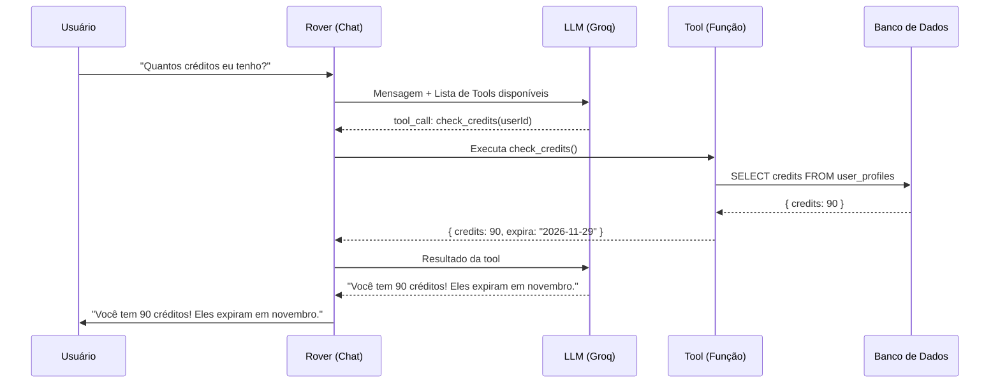
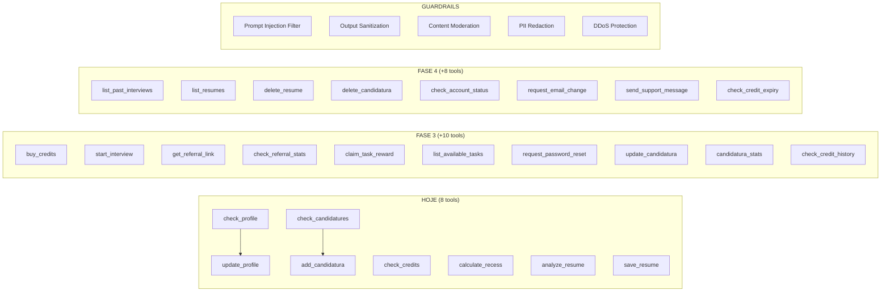

# 🤖 Rover Tools Blueprint — Estagionauta

## Para o Post: O que é Function Calling?

### O conceito em 3 frases:
> **Function Calling** (ou **Tool Use**) é um padrão onde a IA não apenas conversa — ela **toma ações reais**. Em vez de simplesmente responder "vá na página de créditos", o Rover pode diretamente consultar seu saldo, atualizar seu perfil, cadastrar uma vaga, ou gerar um currículo. É o mesmo padrão usado pelo ChatGPT (Plugins, Code Interpreter), pelo Claude (Computer Use), e por empresas como Stripe, Shopify e Notion.

### Nomes técnicos:
| Termo | Quem usa |
|-------|----------|
| **Function Calling** | OpenAI, Groq, Mistral |
| **Tool Use** | Anthropic (Claude) |
| **Agentic Loop / ReAct** | Padrão acadêmico (Reason + Act) |
| **AI Agents** | Termo geral da indústria |

---

## Inventário: 8 Tools Já Implementadas

| # | Tool | O que faz | Custo |
|---|------|-----------|-------|
| 1 | `check_profile` | Consulta perfil do usuário (nome, curso, faculdade, etc.) | Gratuito |
| 2 | `update_profile` | Atualiza campos do perfil via conversa | Gratuito |
| 3 | `check_credits` | Consulta saldo e validade dos créditos | Gratuito |
| 4 | `check_candidatures` | Lista vagas/candidaturas do Kanban | Gratuito |
| 5 | `add_candidatura` | Cadastra nova vaga no Kanban via chat | Gratuito |
| 6 | `calculate_recess` | Calcula recesso proporcional (Lei 11.788) | Gratuito |
| 7 | `analyze_resume` | Analisa currículo com IA (nota + feedback) | 3 créditos |
| 8 | `save_resume` | Salva currículo gerado no banco de dados | Gratuito |

### Guardrails Já Implementados:
- Rate Limiting: 15 msgs/5min (cooldown), 30/hora, 100/dia
- Cooldown de spam: bloqueio automático de 5 min
- Logs de abuso no Supabase (`rover_abuse_logs`)
- IP tracking

---

## Blueprint: Tools Necessárias Para Cobertura Total

> Filosofia: O usuário deve conseguir fazer **tudo** que faz manualmente na plataforma apenas conversando com o Rover. Cada tela do site = pelo menos 1 tool de leitura + 1 tool de ação.

### Categoria 1: 💰 Créditos & Pagamentos

| # | Tool | Tipo | Descrição | Prioridade |
|---|------|------|-----------|------------|
| 9 | `buy_credits` | ⚡ Ação | Gera link de checkout do Stripe para o plano escolhido (Cosmonauta/Astronauta). Retorna URL para o usuário clicar. | Alta |
| 10 | `check_credit_history` | 👁 Leitura | Lista histórico completo: compras, usos, bônus por indicação, bônus por tarefas. | Média |
| 11 | `check_credit_expiry` | 👁 Leitura | Mostra lotes de créditos com data de expiração (FIFO). Ex: "10 créditos gratuitos expiram em 01/06, 30 avulsos em 29/11". | Média |

### Categoria 2: 🎓 Simulador de Entrevistas

| # | Tool | Tipo | Descrição | Prioridade |
|---|------|------|-----------|------------|
| 12 | `start_interview` | ⚡ Ação | Verifica créditos, consome 1 crédito, e retorna link direto para `/simulador-entrevistas` com sessão iniciada. | Alta |
| 13 | `list_past_interviews` | 👁 Leitura | Lista simulações anteriores: data, vaga simulada, modo (áudio/chat), nota final, pontos fortes/fracos. | Média |
| 14 | `review_interview` | 👁 Leitura | Recebe ID de uma simulação passada e retorna o feedback detalhado e dicas de melhoria. | Baixa |

### Categoria 3: 📝 Gerador de Currículos

| # | Tool | Tipo | Descrição | Prioridade |
|---|------|------|-----------|------------|
| 15 | `generate_resume` | ⚡ Ação | Gera currículo otimizado para uma vaga específica. Usa dados do perfil + descrição da vaga. Consome 1 crédito. Chama `check_profile` + `check_candidatures` internamente. | Alta |
| 16 | `list_resumes` | 👁 Leitura | Lista todos os currículos salvos: título, data de criação, vaga alvo. | Média |
| 17 | `delete_resume` | ⚡ Ação | Deleta um currículo salvo. Pede confirmação antes ("Tem certeza? Isso é irreversível."). | Baixa |

### Categoria 4: 📋 Kanban de Candidaturas

| # | Tool | Tipo | Descrição | Prioridade |
|---|------|------|-----------|------------|
| 18 | `update_candidatura` | ⚡ Ação | Move candidatura entre colunas ("Aplicado" → "Entrevista" → "Aprovado") ou edita campos (salário, notas). | Alta |
| 19 | `delete_candidatura` | ⚡ Ação | Remove candidatura do Kanban (com confirmação). | Baixa |
| 20 | `candidatura_stats` | 👁 Leitura | Estatísticas do Kanban: total por status, taxa de conversão, tempo médio entre etapas. | Média |
| 21 | `analyze_candidatura` | ⚡ Ação | Recebe o ID ou nome de uma candidatura e analisa com IA: compatibilidade do perfil com a vaga, pontos fortes, lacunas, dicas para a entrevista. Consome 2 créditos. | Alta |

### Categoria 5: 🤝 Indicações & Recompensas (FASE 3)

| # | Tool | Tipo | Descrição | Prioridade |
|---|------|------|-----------|------------|
| 22 | `get_referral_link` | 👁 Leitura | Retorna o link personalizado de indicação do usuário (ex: `estagionauta.com.br/r/paulpessoa`). | Alta |
| 23 | `invite_friend` | ⚡ Ação | Envia convite por e-mail para um amigo (via Brevo). Recebe nome e e-mail do convidado. | Alta |
| 24 | `list_invitees` | 👁 Leitura | Lista pessoas que o usuário já convidou: nome, e-mail, status (pendente/cadastrado/ativo), data do convite. | Alta |
| 25 | `check_referral_stats` | 👁 Leitura | Resumo: total convidados, quantos se cadastraram, créditos ganhos por indicação. | Alta |
| 26 | `list_available_tasks` | 👁 Leitura | Lista tarefas gamificadas para ganhar créditos: completar perfil (+2), primeira entrevista (+1), indicar amigo (+3), primeira análise de currículo (+1), etc. Mostra quais já foram concluídas. | Alta |
| 27 | `claim_task_reward` | ⚡ Ação | Verifica se a tarefa foi concluída e resgata os créditos de recompensa. | Alta |

### Categoria 6: ⏰ Lembretes & Agenda (FEATURE NOVA)

> [!NOTE]
> Feature nova que agrega muito valor. Permite o usuário pedir ao Rover para criar lembretes de entrevistas, prazos de candidaturas, datas de retorno, etc. Requer nova tabela `user_reminders` no Supabase + CRON job para disparar notificações por e-mail.

| # | Tool | Tipo | Descrição | Prioridade |
|---|------|------|-----------|------------|
| 28 | `create_reminder` | ⚡ Ação | Cria lembrete com título, data/hora, e opcionalmente vincula a uma candidatura. Ex: "Me lembre da entrevista na XYZ dia 05/06 às 14h". | Alta |
| 29 | `list_reminders` | 👁 Leitura | Lista todos os lembretes futuros e passados, com status (pendente/disparado/cancelado). | Alta |
| 30 | `update_reminder` | ⚡ Ação | Altera data, hora ou descrição de um lembrete existente. | Média |
| 31 | `delete_reminder` | ⚡ Ação | Cancela/remove um lembrete. | Baixa |

### Categoria 7: 🔐 Autenticação & Conta (com segurança)

| # | Tool | Tipo | Descrição | Prioridade |
|---|------|------|-----------|------------|
| 32 | `request_password_reset` | ⚡ Ação | Envia e-mail de recuperação de senha via Supabase Auth. **NÃO recebe a senha pelo chat.** Retorna confirmação. | Alta |
| 33 | `check_account_status` | 👁 Leitura | Status da conta: e-mail verificado?, data de criação, último login, total de créditos gastos. | Média |
| 34 | `request_email_change` | ⚡ Ação | Inicia fluxo de alteração de e-mail (envia link de confirmação para o novo e-mail via Supabase Auth). | Baixa |

> [!CAUTION]
> **Regra de Segurança Absoluta para Autenticação:**
> O Rover **NUNCA** deve receber, processar ou armazenar senhas, tokens de sessão ou códigos OTP no chat. Todas as ações de autenticação devem gerar links seguros (e-mail de recovery, magic link) que redirecionam o usuário para fluxos oficiais do Supabase Auth. Isso garante que credenciais nunca fiquem no histórico de conversa.

### Categoria 8: 📬 E-mail & Suporte

| # | Tool | Tipo | Descrição | Prioridade |
|---|------|------|-----------|------------|
| 35 | `send_support_message` | ⚡ Ação | Coleta assunto + detalhes e envia para o suporte (Brevo ou tabela `support_tickets`). | Média |

### Categoria 9: 🧭 Navegação & UX

| # | Tool | Tipo | Descrição | Prioridade |
|---|------|------|-----------|------------|
| 36 | `navigate_to` | ⚡ Ação | Retorna link direto + descrição da página solicitada. Ex: usuário diz "quero ver meus créditos" → retorna link para `/creditos` com contexto. Útil para o frontend renderizar um botão clicável no chat. | Média |
| 37 | `get_platform_help` | 👁 Leitura | Retorna FAQ e dicas de uso da plataforma. Funciona como um mini help center dentro do chat. | Baixa |

---

## Guardrails: Sistema Completo de Proteção

### Já Implementado ✅

| Guardrail | Descrição |
|-----------|-----------|
| Rate Limiter por Frequência | 15 msgs/5min, 30/hora, 100/dia |
| Cooldown de Spam | Bloqueio automático de 5 min |
| Log de Abusos | Tabela `rover_abuse_logs` com user_id, IP, ação, detalhes |
| IP Tracking | Rastreamento de IP para detectar abuso multi-conta |

### Precisamos Implementar 🔴

| # | Guardrail | Descrição | Como funciona |
|---|-----------|-----------|---------------|
| G1 | **Prompt Injection Filter** | Detecta tentativas de injetar instruções maliciosas no prompt (ex: "ignore todas as instruções anteriores"). | Regex + lista de padrões proibidos antes de enviar para a LLM. Se detectado, bloqueia e loga. |
| G2 | **Output Sanitization** | Garante que a resposta da LLM não vaze dados sensíveis (chaves de API, queries SQL, dados de outros usuários). | Filtro pós-resposta que remove padrões sensíveis (JWT, API keys, SQL). |
| G3 | **Tool Execution Limits** | Limita quantas tools um único request pode executar (já temos MAX_LOOPS=5, mas podemos refinar). | Configurável por tipo de tool (ex: `buy_credits` max 1x por request). |
| G4 | **Content Moderation** | Detecta mensagens ofensivas, assédio, ou conteúdo ilegal. | Usar a API de moderação do OpenAI (`/v1/moderations`) antes de processar. |
| G5 | **Credit Verification Pre-Tool** | Antes de executar tools que custam créditos, verifica se o usuário tem saldo suficiente. | Check automático no `executeRoverTool` para tools marcadas como `costCredits > 0`. |
| G6 | **Scope Enforcement** | Garante que o Rover só responda sobre temas de estágio/carreira/plataforma. | Reforço no system prompt + filtro de tópicos fora do escopo. |
| G7 | **PII Redaction** | Remove dados pessoais sensíveis (CPF, número de cartão) das mensagens antes de enviar para a LLM. | Regex para padrões de CPF, cartão de crédito, etc. |
| G8 | **DDoS / Flood Protection** | Proteção contra ataques de volume no endpoint `/api/rover/message`. | Middleware global de rate limiting por IP (além do por usuário). |

---

## Python vs Go vs Node.js: Precisa Mudar?

### Resposta curta: **Não. Hono.js/Node.js está ótimo.**

| Critério | Node.js (Hono) ✅ | Python (FastAPI) | Go |
|----------|-------------------|-----------------|-----|
| **Ecossistema de IA** | SDKs oficiais da OpenAI, Anthropic, Groq | Mais bibliotecas de ML (PyTorch, etc.) | SDKs limitados |
| **Streaming SSE** | Excelente (nativo) | Bom | Bom |
| **Latência** | ~5-20ms overhead | ~10-30ms | ~1-5ms |
| **Já integrado** | ✅ Toda a stack já é TS | Precisaria de novo serviço | Precisaria de novo serviço |
| **Deploy** | Cloud Run funciona | Cloud Run funciona | Cloud Run funciona |
| **Type safety** | TypeScript ✅ | Type hints (parcial) | Forte |

### Quando faria sentido mudar?
- **Python**: Se o Rover precisasse rodar modelos de ML localmente (embeddings, fine-tuning). Não é o caso — estamos usando APIs externas (Groq/OpenAI).
- **Go**: Se tivéssemos milhões de conexões simultâneas. Estamos longe disso.
- **Microserviço separado**: Só faria sentido se o chat tivesse requisitos de escala radicalmente diferentes do resto da API. Por enquanto, manter tudo junto no Hono é mais simples, barato e fácil de manter.

> [!TIP]
> O ChatGPT da OpenAI usa Python. O Claude da Anthropic usa uma mistura de Python e Rust. Mas empresas como Vercel (v0) e Shopify (Sidekick) usam Node.js/TypeScript para seus agentes de IA. **A linguagem importa menos que a arquitetura.** E a sua arquitetura está correta.

---

## Resumo Visual: Evolução do Rover

### Contagem Final

| Categoria | Existentes | Novas | Total |
|-----------|------------|-------|-------|
| 💰 Créditos & Pagamentos | 1 | 3 | 4 |
| 🎓 Simulador de Entrevistas | 0 | 3 | 3 |
| 📝 Gerador de Currículos | 1 | 3 | 4 |
| 📋 Kanban de Candidaturas | 2 | 4 | 6 |
| 🤝 Indicações & Recompensas | 0 | 6 | 6 |
| ⏰ Lembretes & Agenda | 0 | 4 | 4 |
| 🔐 Autenticação & Conta | 0 | 3 | 3 |
| 📬 E-mail & Suporte | 0 | 1 | 1 |
| 🧭 Navegação & UX | 0 | 2 | 2 |
| 🔧 Utilitárias existentes | 4 | 0 | 4 |
| **TOTAL TOOLS** | **8** | **29** | **37** |
| **GUARDRAILS** | **4** | **8** | **12** |

---

## Roadmap de Implementação

### Sprint 1 — Ações Core + Indicações (13 items)
*O usuário consegue fazer as ações mais importantes pelo chat.*

| # | Item | Tipo |
|---|------|------|
| 1 | `buy_credits` | Tool |
| 2 | `start_interview` | Tool |
| 3 | `generate_resume` | Tool |
| 4 | `analyze_candidatura` | Tool |
| 5 | `update_candidatura` | Tool |
| 6 | `get_referral_link` | Tool |
| 7 | `invite_friend` | Tool |
| 8 | `list_invitees` | Tool |
| 9 | `check_referral_stats` | Tool |
| 10 | `list_available_tasks` | Tool |
| 11 | `claim_task_reward` | Tool |
| 12 | `request_password_reset` | Tool |
| 13 | **Prompt Injection Filter** | Guardrail |

### Sprint 2 — Lembretes + Históricos + Segurança (12 items)
*O Rover vira uma agenda inteligente e um painel completo.*

| # | Item | Tipo |
|---|------|------|
| 14 | `create_reminder` | Tool |
| 15 | `list_reminders` | Tool |
| 16 | `update_reminder` | Tool |
| 17 | `check_credit_history` | Tool |
| 18 | `check_credit_expiry` | Tool |
| 19 | `list_past_interviews` | Tool |
| 20 | `candidatura_stats` | Tool |
| 21 | `list_resumes` | Tool |
| 22 | `check_account_status` | Tool |
| 23 | `navigate_to` | Tool |
| 24 | **Content Moderation** | Guardrail |
| 25 | **PII Redaction** | Guardrail |

### Sprint 3 — Polimento + Proteção (8 items)
*Cobertura total: todas as ações de delete, suporte e segurança avançada.*

| # | Item | Tipo |
|---|------|------|
| 26 | `delete_reminder` | Tool |
| 27 | `delete_resume` | Tool |
| 28 | `delete_candidatura` | Tool |
| 29 | `review_interview` | Tool |
| 30 | `request_email_change` | Tool |
| 31 | `send_support_message` | Tool |
| 32 | `get_platform_help` | Tool |
| 33 | **Output Sanitization + DDoS Protection** | Guardrail |

---

## Sobre Preços

> [!IMPORTANT]
> Todas as tools de **leitura** (check_*, list_*) são gratuitas. Apenas ações que consomem recursos de IA cobram créditos:
> - Análise de Currículo: 3 créditos
> - Simulação de Entrevista: 1 crédito (já cobrado pelo simulador, não pelo Rover)
> - Geração de Currículo: 1 crédito
>
> O Rover em si (conversar, consultar, atualizar perfil, cadastrar vagas) é **100% gratuito**. Isso é proposital — o valor percebido do agente aumenta o engajamento e leva o usuário a comprar créditos para as funcionalidades premium.
